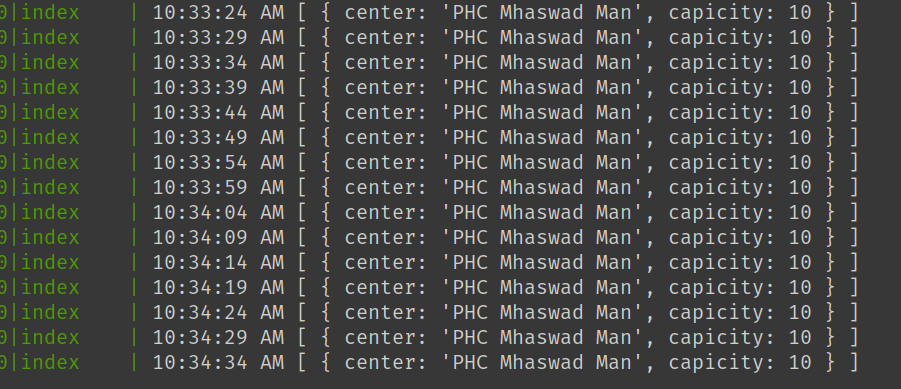

Very basic cowin script which notifies if sessions available.

### Supported Filters
Currently only finds session using `pincode` and `date` & planning to add more later.

## Usage
1. Clone this repo
2. Run `npm install` or `yarn`

### Commands
Run as dev server in command line
`npm run dev` or `yarn dev`

OR

Run with process manager `pm2`
`npm run listen` or `yarn listen`

View pm2 logs by `pm2 logs`

### Results
When `NO` sessions available

When sessions available

